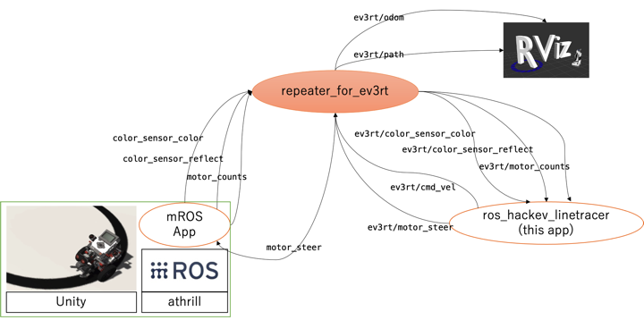
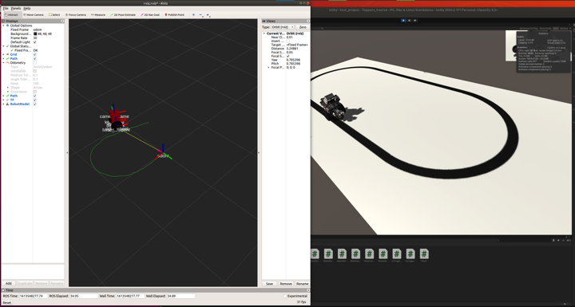
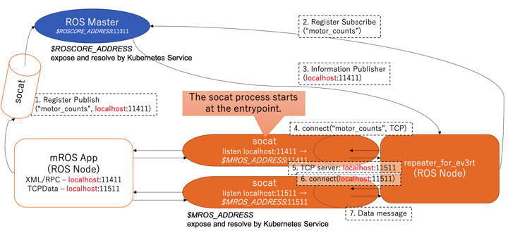

# repeater_for_ev3rt




This repository shows how to use the system test function of R2S2 (RDBOX Robotics Simulation System).  
For more information on ROS topics and nodes, please refer to [rdbox\-intec/ros\_hackev\_linetracer: GitHub](https://github.com/rdbox-intec/ros_hackev_linetracer).

## Architecture

An intermediate process to accept IP addresses from arbitrary Pods when running on kubernetes.  
At the same time, it also exposes information obtained from wheels such as odom and path.

### As ROS App



Offers minimum mobile robot capabilities.

- Simple URDF model.
- Publish several Topics.
  - ev3rt/odom: [nav\_msgs/Odometry](http://docs.ros.org/en/noetic/api/nav_msgs/html/msg/Odometry.html)
  - ev3rt/path: [nav\_msgs/Path](http://docs.ros.org/en/api/nav_msgs/html/msg/Path.html)
- Translate the topic message for ev3rt.
  - ev3rt/cmd_vel: [geometry\_msgs/Twist](http://docs.ros.org/en/jade/api/geometry_msgs/html/msg/Twist.html)
    - Translate to `motor_steer` after receiving a `ev3rt/cmd_vel` (motor_steer is a topic about the speed and amount of steering that the mROS App subscribes to.)

repeater_for_ev3rt App is Configured several nodes.

- [joint\_state\_publisher \- ROS Wiki](http://wiki.ros.org/joint_state_publisher)
  - This package contains a tool for setting and publishing joint state values for a given URDF.
- [robot\_state\_publisher \- ROS Wiki](http://wiki.ros.org/robot_state_publisher)
  - This package allows you to publish the state of a robot to tf2.
- robot_localization/ekf_localization_node
  - robot_localization is a collection of state estimation nodes, each of which is an implementation of a nonlinear state estimator for robots moving in 3D space.

### Why does the R2S2 need a repeater?



In our architectures, we use a combination of Kubernetes services and [socat](https://linux.die.net/man/1/socat) to communicate with ROS nodes running as mROS App.  
(Socat is a command line based utility that establishes two bidirectional byte streams and transfers data between them.)

In repeater_for_ev3rt, the mROS App is disguised as if it is running on localhost.  
The reason this operation is necessary is due to the limitations of the mROS App.  
The mROS App needs to be build with the ROS Master and the IP address of the local node set.  
However, this idea did not fit the dynamic network on Kubernetes clusters.  
So we used this trick to solve the problem.  
Then, repeater_for_ev3rt relays all the topics of the mROS App.  
The reason we need the relay is that communication with the mROS App requires such a big trick.  
By going through the relay function, other general ROS nodes do not need to be aware of the existence of mROS nodes. This is a very big advantage for developers.  

## Usage

The roslaunch command gives the --wait option. Wait for other processes to start up roscore.

```bash
roslaunch --screen --wait repeater_for_ev3rt start.launch
```

The Docker image hosted on [docker hub](https://hub.docker.com/repository/docker/rdbox/repeater_for_ev3rt)

```bash
docker pull rdbox/repeater_for_ev3rt:v0.0.1
```

## Licence

[MIT](https://github.com/rdbox-intec/repeater_for_ev3rt/blob/main/LICENSE)
